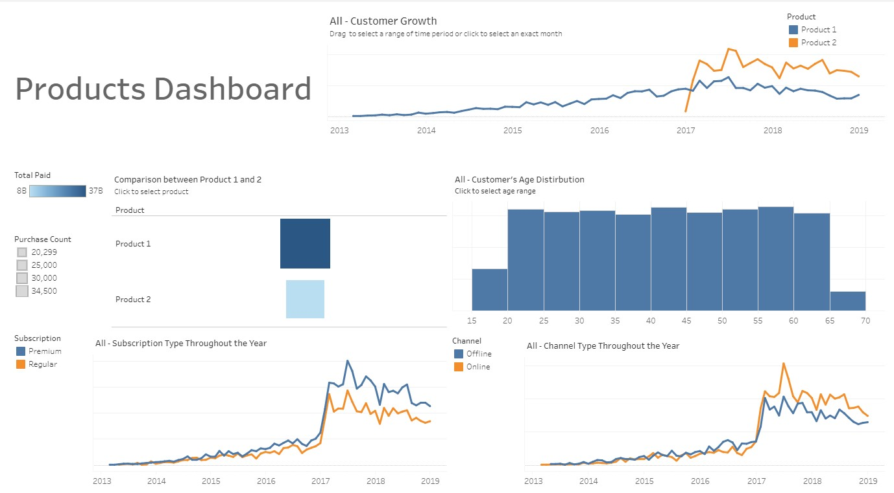

# Dashboard and Insights on Product Historical Data
Here I made a pitch deck to present my insights based on the historical data of two products. 
The data for both products are on the csv files.

Based on the data, I made an interactive visualization using Tableau, which you could take a look on : https://public.tableau.com/app/profile/chandira.irina/viz/ProductHistoricalData/ProductHistoricalData
 
Here is the snapshot of the dashboard:

I also made some other visualization using seaborn and matplotlib on Python, which results can be found on the slide deck, along with the insights.
